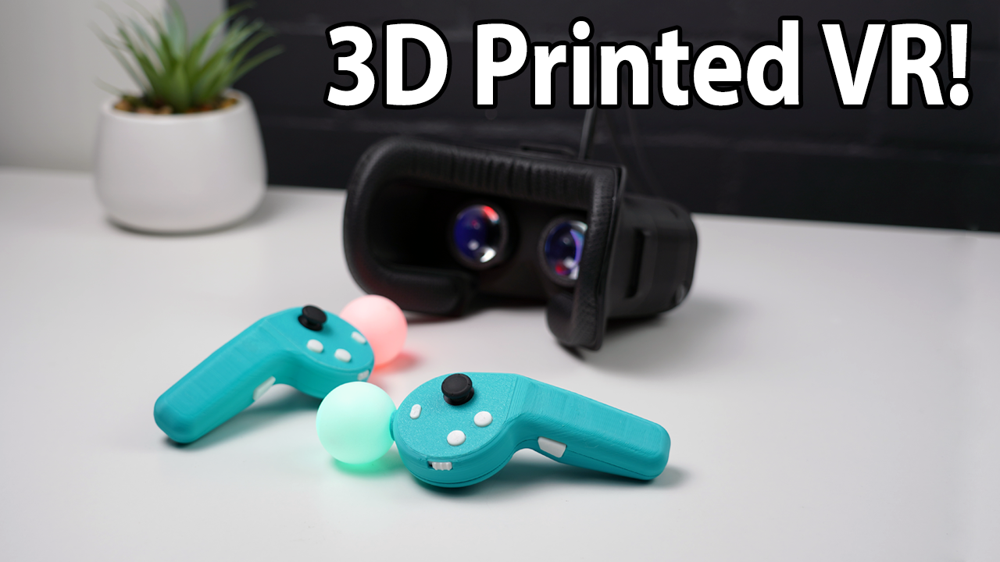

# CNCDan - DIY VR

A fully 3D printed headset design for VR!

[Project Video Link V1.0](https://youtu.be/pbNyW5GsUQc)
[Project Video Link V2.0](https://youtu.be/7cRuXjuuTN8)

#### Features

- 2880x1440p Resolution
- 120hz Refresh Rate
- Inidividually adjustable IPD
- Easily replaceable lenses
- Compatible with HTC Vive Pro Head Pads
- Adjustable brightness
- SteamVR compatible 3 DOF head tracking or 6DOF using PSMoveServiceEX
- Support for wireless controllers https://github.com/dmcke5/DIY_VR_Controllers

This git has been updated for my Version 2 DIY VR design. All of the original files are still here, they've just been renamed to V1.0 if they are no longer in use (along with the original Readme).

I have included a full model of both versions in .STEP format to aid with assembly!

#### Bill of Materials

1x Display Set - https://www.aliexpress.com/item/32975284107.html

1x GY91 IMU board - https://www.aliexpress.com/item/1005005180963415.html

2x NRF24L01 Wireless Module - https://www.aliexpress.com/item/1005007199963170.html

1x 40mm Ping Pong Balls - https://www.aliexpress.com/item/1005009969506572.html

1x Tactile switch - https://www.aliexpress.com/item/1005006497849129.html

2x 3mm x 145mm Stainless Rod - https://www.aliexpress.com/item/1005009347568195.html

6x 3x6(OD) 4mm(L) Brass Bushings - https://www.aliexpress.com/item/1005008668212038.html

1x Arduino Pro Micro USB-C Version - https://www.aliexpress.com/item/32846843498.html

1x Pair 34mm Diameter 45mm Focal Length Lenses - https://www.aliexpress.com/item/1005004324103470.html

1x 1M 25mm Nylon Strapping - https://www.aliexpress.com/item/1005008515249414.html

1x HTC Vive Pro Face Pad - https://www.aliexpress.com/item/1005001324834346.html

#### Hardware

16x M3x5x5 Threaded Inserts

4x M3x12 SHCS

10x M3x8 SHCS

4x M3x12 Standoffs

### Instructions

#### Printing

First, you'll need one of every part printed, except for these items that require multiples:

3x DIY VR Buckle 

2x DIY VR Lens Retainer

2x DIY VR Thumbscrew Head

The files with V1.0 names can be ignored, unless you are specifically making the old version in which case, you can print them and disregard any V2.0 files. Refer the to V1.0 readme for specific Instructions.

There are print recomendations for most of the important parts in the first video.
The V2.0 front cover is much easier to print than V1.0 and can be printed front down with minimal supports.

#### Electronics

Only three SMD parts are required to assemble the PCB, 1x MCP1792-3302xCB and two 470nF 0603 Capacitors. The two NRF modules can be soldered in as usual, but when you solder in the IMU module ensure you remove the black plastic spacer from the pins to ensure the module is sitting flat against the PCB. The Arduino needs to be installed WITH the black plastic spacers, otherwise its USB port won't align with the opening.

Once the head tracker board is assembled, there are three sets of pads you will need to connect. The two pads labelled "Calibrate" are to be wired to the tactile switch on the side of the headset. The three pads labelled VCC, GND and DO are to be connected to an addressable RGB LED that is used for the pingpong ball.
The final two pads labelled VCC and GND are to supply power to your display driver and should be connected accordingly.

#### Head Tracking Software/Firmware

Revision 2.0 of the head tracker relies on the HadesVR driver. I have included a slightly modified version of their firmware here, which you will need to use as it adds support for the addressable RGB led used for the tracking bulb.

Refer to the HadesVR github page for upload and config instructions: 
https://github.com/HadesVR/Basic-HMD-PCB?tab=readme-ov-file#uploading-the-firmware-and-calibrating-the-sensors

If you're using the 6DOF tracking, you will also need to go through the PSMoveServiceEX Setup process. Their documentation is here: https://github.com/Timocop/PSMoveServiceEx/wiki

#### Physical Build

Refer to both of the project videos for build steps and I will add anything here in future if anyone requests extra information!
