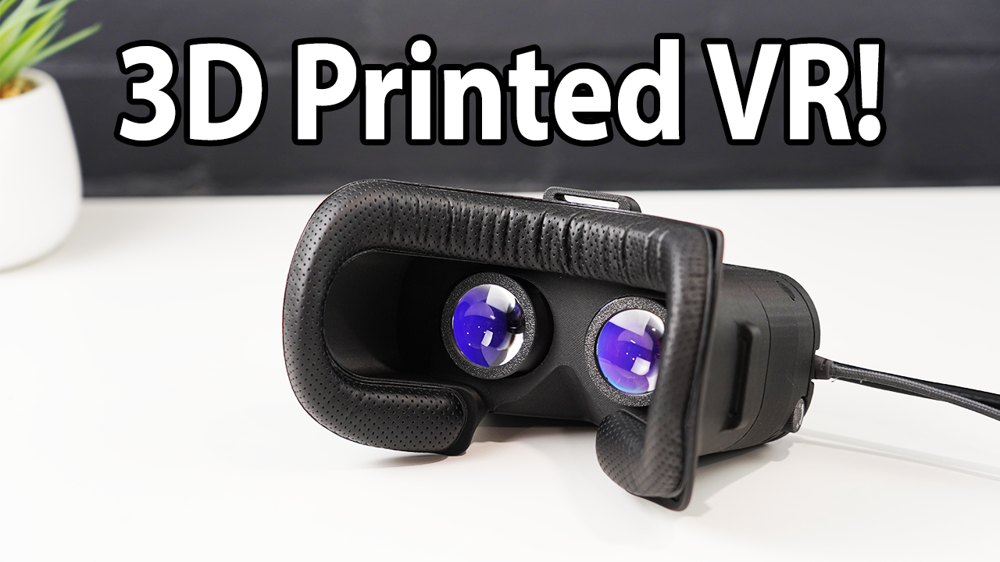

# CNCDan - DIY VR

A fully 3D printed headset design for VR!

[Project Video Link](https://youtu.be/DYXRUFX2avY)

#### Features

- 2880x1440p Resolution
- Inidividually adjustable IPD
- Easily replaceable lenses
- Compatible with HTC Vive Pro Head Pads
- Adjustable brightness
- Duplicate or extend display modes for VR or regular viewing
- SteamVR compatible 3 DOF head tracking

#### Bill of Materials

1x Display Set (this is the one I used in the video with the issue of not reaching 90hz when in full resolution mode) - https://www.aliexpress.com/item/1005008906958871.html

1x IMU board (any variety that FastIMU supports is fine) - https://www.aliexpress.com/item/1005007284708262.html

2x 3mm x 145mm Stainless Rod - https://www.aliexpress.com/item/1005009347568195.html

6x 3x6(OD) 4mm(L) Brass Bushings - https://www.aliexpress.com/item/1005008668212038.html

1x Arduino Pro Micro USB-C Version - https://www.aliexpress.com/item/32846843498.html

1x Pair 34mm Diameter 45mm Focal Length Lenses - https://www.aliexpress.com/item/1005004324103470.html

1x 1M 25mm Nylon Strapping - https://www.aliexpress.com/item/1005008515249414.html

1x HTC Vive Pro Face Pad - https://www.aliexpress.com/item/1005001324834346.html

#### Hardware

16x M3x5x5 Threaded Inserts
4x M3x12 SHCS
10x M3x8 SHCS

### Instructions

#### Printing

First, you'll need one of every part printed, except for these items that require multiples:

3x DIY VR Buckle 

2x DIY VR Lens Retainer

2x DIY VR Thumbscrew Head

There are print recomendations for most of the important parts in the video, except for the front cover. It's a difficult print to do well, and would ideally be printed back-side down with support interface material enabled. If you can't do multi-material prints, your next best bet would be to print it front-side down and just expect to do some cleanup on the front beveled edges.

#### Electronics

Only four connections are needed between the Arduino and the IMU, VCC, GND, SCL and SDA. If you decide not to use the PCB, you can just wire them manually as follows:

Arduino  |  IMU
VCC      |  VCC
GND      |  GND
D2       |  SDA
D3       |  SCL